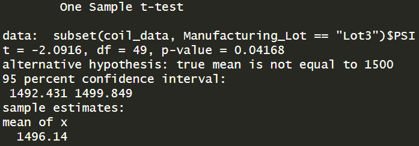

# MechaCar Statistical Analysis

## Project Purpose
The company AutosRUs wants to improve their decision making process on improving their MechaCar by implementing data driven analysis and statistics. Using old data provided by the company, we will perform retrospective analysis, analytical verification and validation of current automotive specifications, and study design of future product testing.

## Resources
- Software: 
	- R
	- RStudio
	- tidyverse
	- ggplot2
	
## Results

### Linear Regression to Predict MPG

- Both the Vehicle Length (p-value = 2.60x10^-12) and Ground Clearance (p-value = 5.21x10^-08) variables have the most significant impact on the MPG of MechaCar. The intercept (-104.0) is also significant, implying other important variables that impact MPG not included in the given dataset.
- The slope of the linear model is not considered to be zero because the coefficients of the significant variables are non-negligible. Assuming a confidence level of α=0.05, we can see that the calculated p-value of 5.35x10^-11 is much lower than α, therefore their is an extremely high probability that the relationships between our variables and the MPG is not just random chance.
- This linear model predicts the miles per gallon of mechacar fairly effectively. Our r-squared value of 0.7149 implies a 71.5% accurate representation of the data.

### Summary Statistics on Suspension Coils

The design specifications of the MechaCar dictate that the variance of the suspension coils can not exceed 100 lbs/in^2 . The variance for the combined lots is below the specified threshold sitting at 62.29, therefore meeting the design specifications. However, the variance for Lot 3 is 170.29, which far exceeds the appropriate design.

### T-Tests on Suspension Coils

Looking at the t-test results for all of the lots together, we can see that the mean is not statistically different than the population mean of 1500. The p-value of 0.06028 is above the confidence level of 0.05. Therefore we do not have sufficient evidence to reject the null hypothesis.

The results for Lot 1 is not statistically different to the population mean. The p-value for Lot 1 is 1, which does not give us sufficient evidence to reject the null hypothesis. 

The results for Lot 2 is not statistically different to the population mean. The p-value for Lot 2 is 0.6072, which does not give us sufficient evidence to reject the null hypothesis. 

The results for Lot 3 imply a slight statistical difference to the population mean.
The p-value for Lot 3 is 0.04168, which is below our confidence level of 0.05. Therefore we do have a sufficient evidence to reject the null hypothesis. However, the results are extremely close, and further inspection of Lot 3 may be needed.

## Study Design: MechaCar vs Competition

Because of recent trends of green energy, electric vehicles, and a push for greater environmental protection and awareness, consumers nowadays greatly value overall fuel efficiency

### Metric to be tested

The fuel efficiency (highway and city) of MechaCar can be calculated in terms of miles per gallon of fuel, and compared to competitors' vehicles.

### Hypothesis

<b>H0</b>: The fuel efficiency of the MechaCar in MPG is the same as competitors.

<b>Ha</b>: The fuel efficiency of the MechaCar in MPG is statistically different compared to competitors.

### Statistics

The best statistical test to use to test these hypothesis is the two sample t test, which is best used to see if there is a statistical difference between two different groups.

### Data
The data necessary for this analysis will be the fuel efficiency of the MechaCar in MPG and the same for all competitors' vehicles as well.